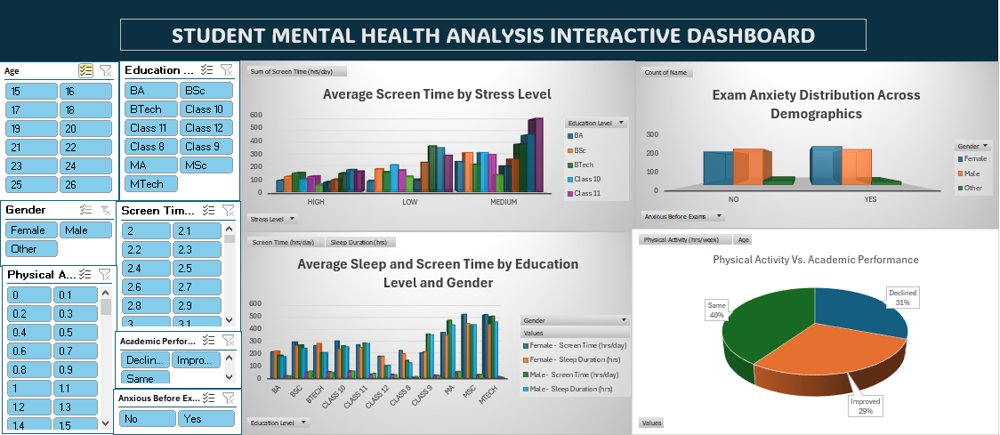
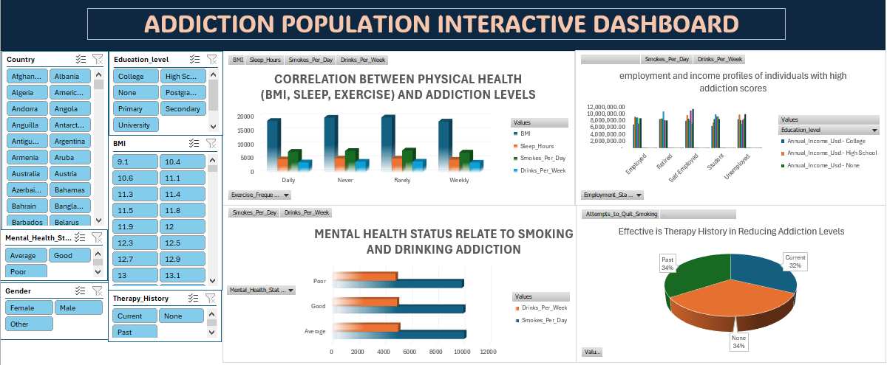
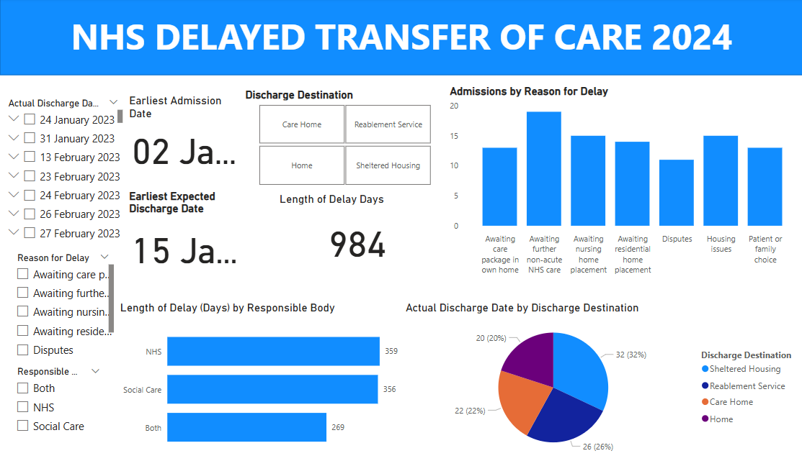

# Project 1

**Title:** [Mental Health Dashboard](https://github.com/AjeneJo/Ajene.github.io/blob/main/Student%20Mental%20Health%20Analysis.xlsx)

**Tools Used:** Advanced Microsoft Excel (Pivot table, Pivot charts, Slicers, Timeline)

**Project Description:** This project focused on analysing student mental health data collected during the shift to online learning. The goal was to identify behavioral, emotional, and lifestyle factors impacting student well being and academic performance. Insights were designed to support educators, counsellors, and policy leaders in making informed decisions on mental health interventions.

**Key Insights:**

*High Screen Time=High Stress:* Students with elevated stress levels recorded significantly higher screen time.

*Physiscal Activity Reduced:* Regular activity was linked to improved academic performance and lower stress.

*Gender-Based sleep patterns:* Sleep duration and screen time varied notably accross gender and education levels.

*Exam Anxiety Widespread:* Prevalent accross several demographics, especially in older age groups or higher academic tiers.

*Need for Support:* A majority reported moderate stress, with a significant portion showing high stress—indicating a need for targeted support systems.

*The dashboard includes interactive features that allow stakeholders to:*

Compare average screen time across different stress levels and education groups.

Analyze the relationship between physical activity and both stress levels and academic performance.

Examine average sleep duration and screen time across gender and education levels.

Assess the prevalence of exam anxiety across various demographics.

Understand the distribution of stress levels among the student population.

**Interactive Filters:** Gender | Age Group | Education Level | Mental Health Status | Therapy History | Physical Activity Level

**Key findings:** High Stress Linked to Screen Time: Students with higher stress levels spent significantly more time on screens.

Physical Activity Helps: Regular physical activity correlated with reduced stress and better academic performance.

Gender Differences in Sleep: Average sleep duration and screen time patterns varied by gender and education level.

Exam Anxiety Prevalence: A notable number of students experienced pre-exam anxiety, especially in certain demographics.

Stress Patterns: Most students reported moderate stress levels, with a sizable percentage reporting high stress, suggesting the need for well-being support systems.

**Dashboard Overview:** *The dashboard includes the following key visualizations:*

Average Screen Time by Stress Level and Academic Performance

Physical Activity vs. Stress and Performance

Sleep & Screen Time by Gender and Education Level

Exam Anxiety Distribution Across Demographics

Stress Level Distribution (Pie/Bar Chart)

**Impact:** *This dashboard enables stakeholders to:*

Make informed decisions based on behavioral patterns.

Prioritize student mental health initiatives.

Adapt academic strategies to improve student well-being during and after online learning transitions.

Monitor behavioural patterns affecting student wellbeing.

Prioritise mental health initiatives and early intervention.

# Project 2

**Title:** [Addiction Population Dashboard](https://github.com/AjeneJo/Ajene.github.io/blob/main/Addiction%20Population%20Data%201.xlsx)

**Tools Used:** Advanced Microsoft Excel (Pivot table, Pivot charts, Slicers, Timeline)

**Project Description:** This project analyzed population data related to addiction, mental health, physical wellness, and socioeconomic factors. The primary objective was to identify correlations between 

behavioral health and addiction patterns such as smoking and drinking, and to explore how demographic and lifestyle factors influence recovery outcomes.

The interactive dashboard was developed to help healthcare professionals, policymakers, and researchers explore the underlying factors driving addiction severity, therapy effectiveness, and mental health 

status.

**Key findings:** Mental Health & Addiction: Individuals with poorer mental health status tend to show higher smoking and drinking addiction levels.

Lifestyle Impact: Better sleep, regular exercise, and a healthy BMI correlate with reduced addiction scores.

Income & Employment Links: Unemployed individuals and those with lower income levels showed higher addiction tendencies.

Therapy Effectiveness: Those with a history of therapy had slightly lower addiction levels and higher attempts to quit.

Geographic Trends: Certain cities and countries showed disproportionately high addiction levels, indicating regional disparities.

**Dashboard Overview:** The dashboard features several analytical views, including:

Mental Health Status vs. Smoking and Drinking Addiction

Correlation of BMI, Sleep, and Exercise with Addiction Scores

Income and Employment vs. Addiction Severity

Therapy History and Recovery Attempts

Country & City-wise Addiction Mapping

**Impact:** This dashboard serves as a decision-support tool for:

Public health officials targeting interventions by location and demographic.

Researchers studying behavioral health determinants.

Healthcare planners designing therapy and awareness campaigns based on evidence.

# Project 3

**Title:** Work Place Safety Data

**SQL Code:** [Work Place Safety SQL Code](https://github.com/AjeneJo/Ajene.github.io/blob/main/Work_Place_Data.sql)

**SQL Skills Used:** Data Retrieval (SELECT): Queried specific fields and created custom result sets for insights on costs, days lost, and incident counts.

Data Aggregation (SUM, COUNT, AVG, MAX): Calculated total and average incident costs, days lost, and frequencies by plant, department, and incident type.

Data Filtering (WHERE, IN, BETWEEN, AND, OR): Extracted relevant subsets of data, such as “Lost Time” incidents or specific age groups affected by certain hazards.

Grouping and Categorization (GROUP BY): Analyzed incident trends grouped by year, shift, report type, gender, and injury location.

Sorting and Ranking (ORDER BY, LIMIT): Identified top incident types, highest-cost cases, and months with peak incident counts.

Date and Time Handling: Leveraged YEAR and MONTH fields to generate time-series reports.

Aliases and Naming (AS): Cleaned output presentation with readable column names for use in dashboards and exports.

**Project Description:** Developed a comprehensive SQL-driven analysis of workplace incident data to uncover patterns in safety incidents across departments, 

shifts, plants, and demographic groups. The project supported safety strategy improvements by identifying high-risk areas, costly incidents, and common injury 

causes.

**Technology used: SQL server:**

**Outcome:** Enabled data-driven safety interventions and risk assessments. The dashboard provided stakeholders with clear visibility into operational safety
performance, allowing proactive measures to reduce future incidents and costs.

# Project 4

**Title:** Insurance Risk Coverage and Policy Distribution

**SQL Code:** [Insurance Policy Coverage](https://github.com/AjeneJo/Ajene.github.io/blob/main/Insurance_Data.sql)

**SQL Skills Used:** Data Aggregation (SUM, COUNT, AVG), Filtering (WHERE, AND, OR), Grouping (GROUP BY) Sorting (ORDER BY), Distinct Value Extraction (DISTINCT) Conditional Logic Date Range Analysis (MIN, 

MAX). Data Retrieval (SELECT): Queried and extracted specific information from the database. Data Aggregation (SUM, COUNT): Calculated totals, such as sales and quantities, and counted records to analyze data 

trends.

Data Filtering (WHERE, BETWEEN, IN, AND): Applied filters to select relevant data, including filtering by ranges and lists.

Data Source Specification (FROM): Specified the tables used as data sources for retrieval

**Project Description:** In this project, I explored a dataset of insurance policy records to analyze risk exposure, coverage trends, and value concentration by location and policy type. The queries focused 

on identifying high-insured-value areas, coverage frequency for risks like earthquakes and floods, and the distribution of policy types across states and regions. The outcomes enabled actionable 

recommendations for risk mitigation strategies, policy restructuring, and regional insurance planning.

**Technology used:** SQL server

# Project 5

**Title:** Office Supply Sales Data Insights & Performance Trends

**SQL Code:** [Office Supply Sales Insights](https://github.com/AjeneJo/Ajene.github.io/blob/main/Office_Supply_Sales_Insight.sql)

**SQL Skills Used:** Data Retrieval (SELECT): Queried and extracted specific information from the database. Data Aggregation (SUM, COUNT): Calculated totals, such as sales and quantities, and counted records 

to analyze data trends. Data Filtering (WHERE, BETWEEN, IN, AND): Applied filters to select relevant data, including filtering by ranges and lists. Data Source Specification (FROM): Specified the tables used 

as data sources for retrieval. Data Retrieval (SELECT) Filtering (WHERE, IN, BETWEEN) Aggregation (SUM, COUNT, AVG) Sorting (ORDER BY) Grouping (GROUP BY) Pattern Matching (LIKE) Date Functions (YEAR, MONTH)

Joining Columns & Basic Calculations.

**Project Description:** This project involved analyzing office supply sales data to extract insights on product performance, sales region dynamics, and representative activity. Using SQL queries, I explored 

the dataset to answer business-relevant questions such as identifying top-selling items, high-revenue regions, and seasonal trends. The analysis also revealed sales representatives with the highest total 

sales and products with the highest unit cost. These insights support better inventory planning, sales forecasting, and targeted business decisions.

**Technology used:** SQL server

# Project 6

**Title:** [NHS Delayed Transfer of Care](https://github.com/AjeneJo/Ajene.github.io/blob/main/NHS_Delayed_Transfers_of_Care.xlsx)

**Tools Used:** Power BI – for interactive dashboard creation and data visualisation

Advanced Microsoft Excel – for data cleaning, preparation and analysis

DAX (Data Analysis Expressions) – for calculated fields and measures

Data Modelling Techniques – to build relationships between datasets

**Project Description:** This project analyses delayed transfers of care (DTOC) in hospitals across 2024, with a focus on discharge patterns, delay causes, and responsible bodies. The aim is to identify key bottlenecks in hospital discharge processes, evaluate the length and reasons for delays, and provide actionable insights for NHS and social care services to improve patient flow and service efficiency.

The dataset includes variables such as:

Admission and discharge dates

Expected discharge dates

Reasons for discharge delays

Responsible bodies (NHS, Social Care, or Both)

Final discharge destinations (e.g., Home, Care Home)

**Key findings:** Total Length of Delay across all discharges was 984 days, indicating considerable impact on hospital bed availability.

Top Delay Reason: “Awaiting further non-acute NHS care” had the highest frequency of delays, followed by delays for nursing home placements and housing issues.

Discharge Destinations: Most patients were discharged to Sheltered Housing (32%), followed by Reablement Services (26%) and Home (22%).

Responsible Bodies:

NHS accounted for 359 delay days, marginally higher than Social Care with 356 days.

Cases involving both bodies combined contributed 269 delay days, indicating the need for improved joint coordination.

**Dashboard Overview:** This Power BI dashboard provides a comprehensive insight into NHS delayed transfer of care in 2024. It includes:

Filters for discharge date, reason for delay, and responsible body.

KPI Cards showing the earliest admission/expected discharge dates and total delay days.

Bar Charts detailing:

Admissions by reason for delay

Length of delay by responsible body

Pie Chart displaying discharge destinations proportionally.

Interactive Tiles for discharge destination filters.

The dashboard enables hospital administrators and care coordinators to monitor delay trends, evaluate accountability, and prioritise interventions that will reduce hospital stay durations and optimise patient care transitions.

# Project 7

**Title:** Nexia Financial Report 2024

**Tools Used:** 

**Project Description:**

**Key findings:**

**Dashboard Overview:**
